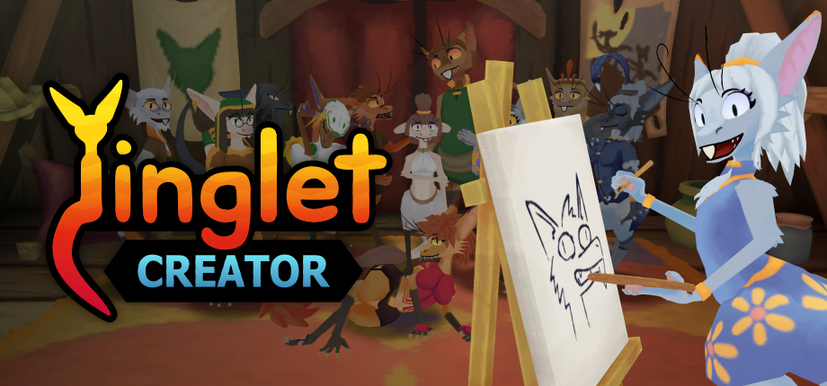

Source code for [Yinglet Creator on Steam](https://store.steampowered.com/app/3954540/Yinglet_Creator/).

# Get Started

To create mods or contribute changes, you'll want to visit the [Yinglet Creator Development Wiki](https://github.com/TBartl/YingletCreator/wiki/0.-Yinglet-Creator-Development-Wiki).

It has all the information you need to set up the project and start developing.

# License

Exported models are free to use anywhere, with a [CCO license](https://creativecommons.org/publicdomain/zero/1.0/)

The Unity project itself was primarily made open source to support mod development.

 - If you want to contribute to the project itself, you're welcome to open a PR.

 - If you want to make any derivative projects, I ask that you respect the [CC BY-NC-SA 4.0 license](https://creativecommons.org/licenses/by-nc-sa/4.0/deed.en)
